### In this project, we will build a CI/CD pipeline to deploy applications to a Kubernetes cluster using Jenkins. This comprehensive tutorial covers deploying to Kubernetes with Jenkins, providing hands-on experience with DevOps practices and Terraform. The project is an excellent opportunity to practice DevOps skills, featuring a complete CI/CD setup, AWS integration, SonarQube for code quality analysis, Trivy for security scanning, and deploying applications to AWS EKS. This guide is perfect for anyone looking to enhance their DevOps expertise through practical, real-world projects.

[YT Link](https://www.youtube.com/watch?v=dMVrwaYojYs&list=PLJcpyd04zn7rZtWrpoLrnzuDZ2zjmsMjz&index=5)

- __URL Repo__: https://github.com/mrbalraj007/a-swiggy-clone/tree/main

Create a IAM user and give full admin previliage.

Configure the AWS account.

terraform init
terraform fmt
terraform validate
terraform plan
terraform apply --auto-approve

will install few plug-in
- Eclipse Temurin installer
- SonarQube Scanner
- Sonar Quality Gates
- Quality Gates
- NodeJS
- Docker 
- Docker Commons
- Docker Pipeline
- Docker API
- docker-build-step
- 
### We needs to configure tools
Dashboard > Manage Jenkins > Tools
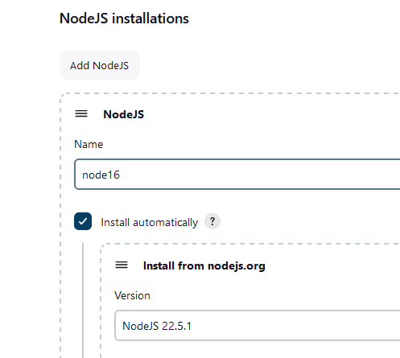

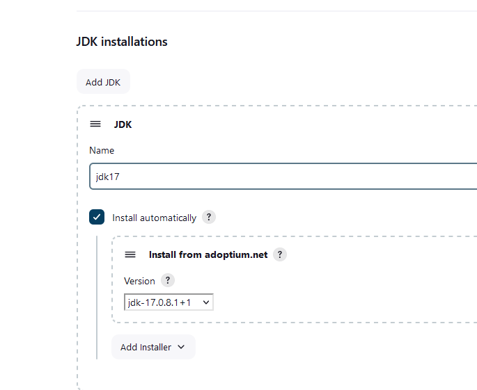
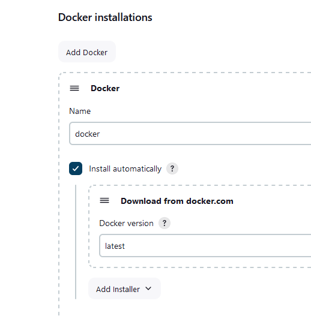
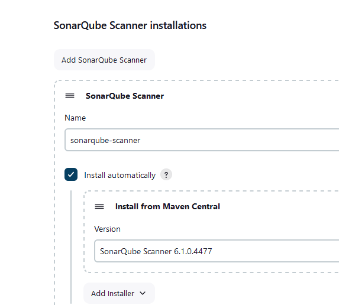

# Configure SonarQube and Integrate SonarQube with Jenkins

Generate the token from SonarQube

squ_ee2dd504da67bda0413a9f3a042c8decf510bab3

Will add that SonarQUbe Token in Jenkins.


Will go to SonarQube and configure as below
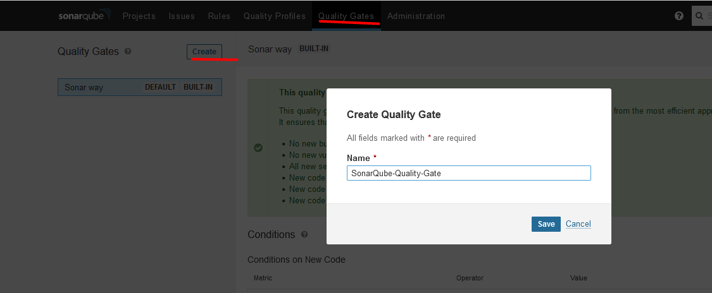

- Configure the webhook.

http://172.31.16.10:8080/sonarqube-webhook/
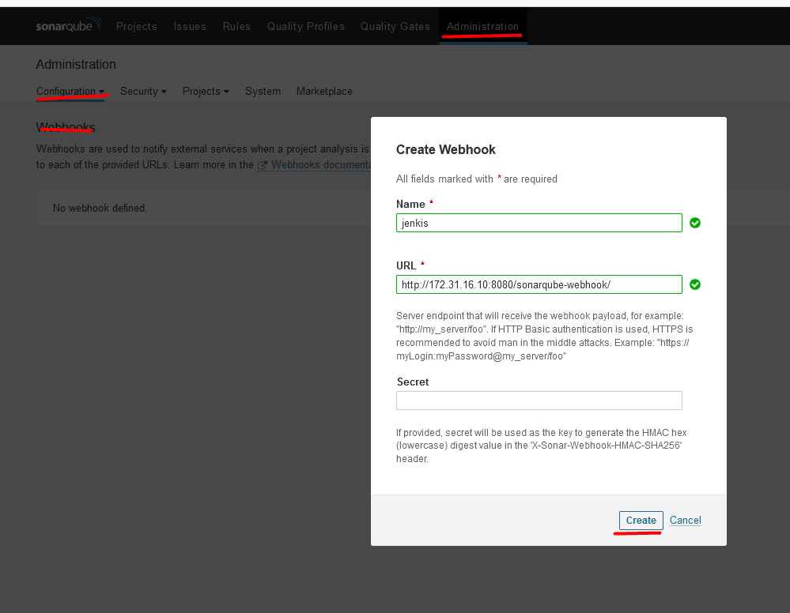

# Create Jenkins Pipeline to Build and Push Docker Image to DockerHib.

Create a pipeline
-Name: swiggy-CICD
Type: pipeline
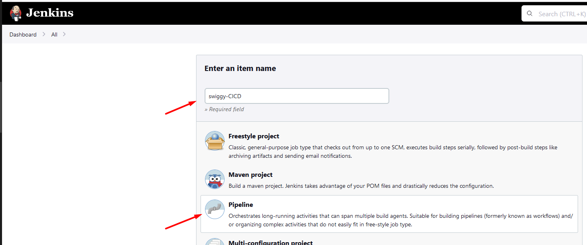
```sh
pipeline{
     agent any
     
     tools{
         jdk 'jdk17'
         nodejs 'node16'
     }
     environment {
         SCANNER_HOME=tool 'sonarqube-scanner'
     }
     
     stages {
         stage('Clean Workspace'){
             steps{
                 cleanWs()
             }
         }
         stage('Checkout from Git'){
             steps{
                 git branch: 'main', url: 'https://github.com/mrbalraj007/a-swiggy-clone'
             }
         }
        stage("Sonarqube Analysis "){
             steps{
                 withSonarQubeEnv('SonarQube-Server') {
                     sh ''' 
                     $SCANNER_HOME/bin/sonar-scanner -Dsonar.projectName=Swiggy-CICD \
                     -Dsonar.projectKey=Swiggy-CICD 
                     '''
                 }
             }
         }
        stage("Quality Gate"){
            steps {
                 script {
                     waitForQualityGate abortPipeline: false, credentialsId: 'SonarQube-Token' 
                 }
             } 
         }
        stage('Install Dependencies') {
             steps {
                 sh "npm install"
             }
         }
         stage('TRIVY FS SCAN') {
             steps {
                 sh "trivy fs . > trivyfs.txt"
             }
         }
         
    }
}
```

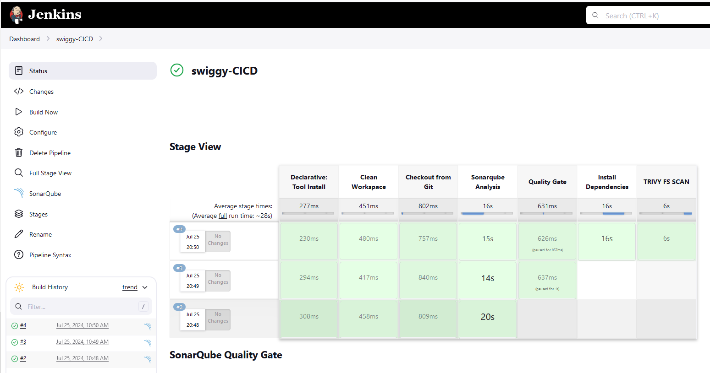


### Dockerhub login

Will create a token from dockerhub, because that token would be used in pipeline.

- will configure docker account in jenkins
    Dashboard
    Manage Jenkins
    Credentials
    System
    Global credentials (unrestricted)


will add docker details in pipeline.


# Create AWS EKS cluster and download the Config/Secret file for EKS Cluster.

```sh
#1--Install kubectl on Jenkins
 sudo apt update
 sudo apt install curl
 curl -LO https://dl.k8s.io/release/$(curl -L -s https://dl.k8s.io/release/stable.txt)/bin/linux/amd64/kubectl
 sudo install -o root -g root -m 0755 kubectl /usr/local/bin/kubectl
 kubectl version --client

# 2--Install AWS Cli

curl "https://awscli.amazonaws.com/awscli-exe-linux-x86_64.zip" -o "awscliv2.zip"
sudo apt install unzip
unzip awscliv2.zip
sudo ./aws/install
aws --version

# 3--Installing  eksctl

curl --silent --location "https://github.com/weaveworks/eksctl/releases/latest/download/eksctl_$(uname -s)_amd64.tar.gz" | tar xz -C /tmp
cd /tmp
sudo mv /tmp/eksctl /bin
eksctl version
```
#### will create a new role and attach it to Jenkins server (where will be installing the ekscluster)
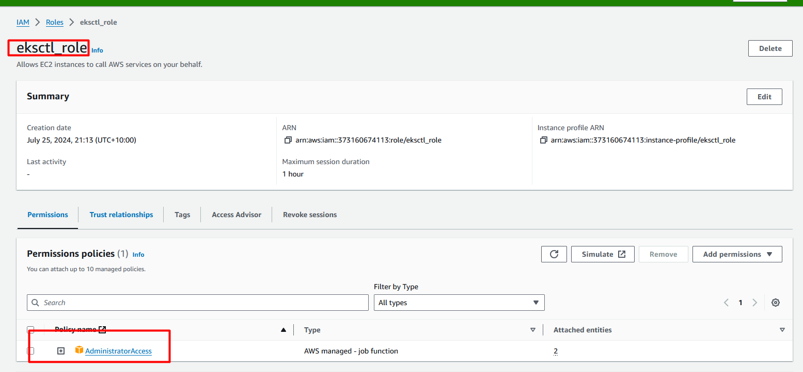
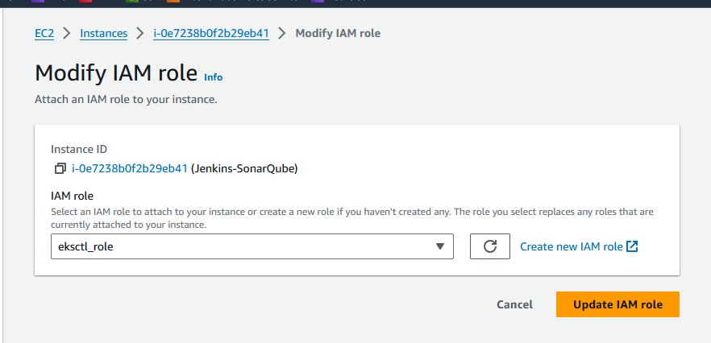

```sh
# 4--Setup Kubernetes using eksctl
# Refer--https://github.com/aws-samples/eks-workshop/issues/734
eksctl create cluster --name mr-singh-cluster \
--region us-east-1 \
--node-type t2.small \
--nodes 3

# 5-- Verify Cluster with below command
$ kubectl get nodes
$ kubectl get svc
```

# Configure the Jenkins Pipeline to Deploy Application on AWS EKS
Will install the following plug-in
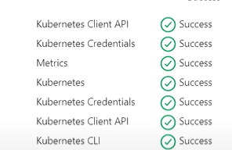


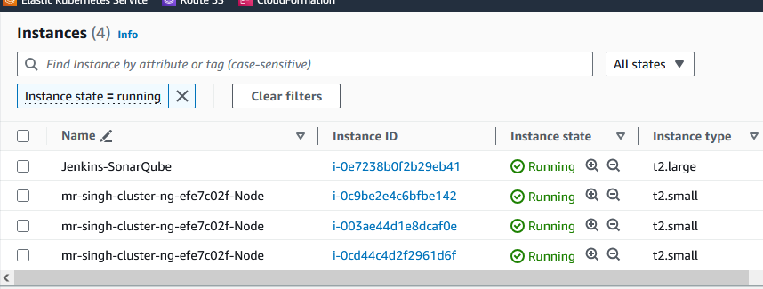

- Config file saved on ``` saved kubeconfig as "/home/ubuntu/.kube/config"```

Open that file and save as ```secret.txt``


will configure the kubernets credentails.
    Dashboard
    Manage Jenkins
    Credentials
    System
    Global credentials (unrestricted)


```sh
pipeline{
     agent any
     
     tools{
         jdk 'jdk17'
         nodejs 'node16'
     }
     environment {
         SCANNER_HOME=tool 'sonarqube-scanner'
     }
     
     stages {
         stage('Clean Workspace'){
             steps{
                 cleanWs()
             }
         }
         stage('Checkout from Git'){
             steps{
                 git branch: 'main', url: 'https://github.com/mrbalraj007/a-swiggy-clone'
             }
         }
        stage("Sonarqube Analysis "){
             steps{
                 withSonarQubeEnv('SonarQube-Server') {
                     sh ''' 
                     $SCANNER_HOME/bin/sonar-scanner -Dsonar.projectName=Swiggy-CICD \
                     -Dsonar.projectKey=Swiggy-CICD 
                     '''
                 }
             }
         }
        stage("Quality Gate"){
            steps {
                 script {
                     waitForQualityGate abortPipeline: false, credentialsId: 'SonarQube-Token' 
                 }
             } 
         }
        stage('Install Dependencies') {
             steps {
                 sh "npm install"
             }
         }
         stage('TRIVY FS SCAN') {
             steps {
                 sh "trivy fs . > trivyfs.txt"
             }
         }
        stage("Docker Build & Push"){
             steps{
                 script{
                    withDockerRegistry(credentialsId: 'dockerhub', toolName: 'docker'){   
                        sh "docker build -t swiggy-clone ."
                        sh "docker tag swiggy-clone balrajsi/swiggy-clone:latest "
                        sh "docker push balrajsi/swiggy-clone:latest "
                     }
                 }
             }
         }
        stage("TRIVY"){
             steps{
                 sh "trivy image balrajsi/swiggy-clone:latest > trivyimage.txt" 
             }
         }
        
        stage('Deploy to Kubernets'){
             steps{
                 script{
                     dir('Kubernetes') {
                         withKubeConfig(caCertificate: '', clusterName: '', contextName: '', credentialsId: 'kubernetes', namespace: '', restrictKubeConfigAccess: false, serverUrl: '') {
                         sh 'kubectl delete --all pods'
                         sh 'kubectl apply -f deployment.yml'
                         sh 'kubectl apply -f service.yml'
                         }   
                     }
                 }
             }
         } 
    }
}
```
Current state of nodes, service.


configure the pipeline and add stage.


Try to access the service and swiggy application should be accessible.
```sh
a696b038dc78e437b96524ce5e171a5a-2052783156.us-east-1.elb.amazonaws.com
```


# Set the trigger and Verify CI/CD Pipeline

now, we will try to automate the whole pipeline.

under the general


create a webhook with github<>Jenkins


Try to change in codes


****************************
# Cleanup
1--Delete EKS Cluster
```sh
eksctl delete cluster mr-singh-cluster --region us-east-1     
OR    
eksctl delete cluster --region=us-east-1 --name=mr-singh-cluster
```
2--Delete EC2 Instance with below Terraform Command
```sh
terraform destroy
```