#### Deploying a YouTube Clone App with DevSecOps & DevOps tools like Jenkins Shared Library Using Docker and Kubernetes.

This blog will help you set up a secure DevSecOps pipeline for your project. Using tools like Kubernetes, Docker, SonarQube, Trivy, OWASP Dependency Check, Prometheus, Grafana, Jenkins (with a shared library), Splunk, Rapid API, and Slack notifications, we make it easy to create and manage your environment.

Environment Setup:

Step 1: Launch an Ubuntu instance for Jenkins, Trivy, Docker and SonarQube

-I am using Terraform to create a infrastrucutre. I have prepared the Terraform code.
+ clone the git [repo](https://github.com/mrbalraj007/DevOps_free_Bootcamp/tree/main/06.Real-Time-DevOps-Project/Terraform_Code) where Terraform code is created.
+ Do the ```ls``` in terminal
```bash
$ cd Terraform_Code
$ ls -l
total 20
drwxr-xr-x 1 bsingh 1049089    0 Jul 28 12:45 Code_IAC_Jenkins_Trivy_Docker/
drwxr-xr-x 1 bsingh 1049089    0 Jul 28 12:47 Code_IAC_Splunk/
-rw-r--r-- 1 bsingh 1049089  632 Jul 28 12:46 main.tf
```
Now, we have to run the following command
```bash
$ Terraform init
$ Terraform fmt  # for formatting
$ Terraform validate # for validate the codes
$ Terraform plan # for plan the Terraform
$ Terraform apply # to Apply the terraform code.
```
*Note:* __Once you apply the Terraform code, wait for 5 minutes to get both instances ready and configure them as below.__

Now, we will configure the Jenkins.
<EC2 Public IP Address:8080>
- To unlock the setup password
```bash
sudo cat /var/lib/jenkins/secrets/initialAdminPassword
```


- Dashboard for Jenkins
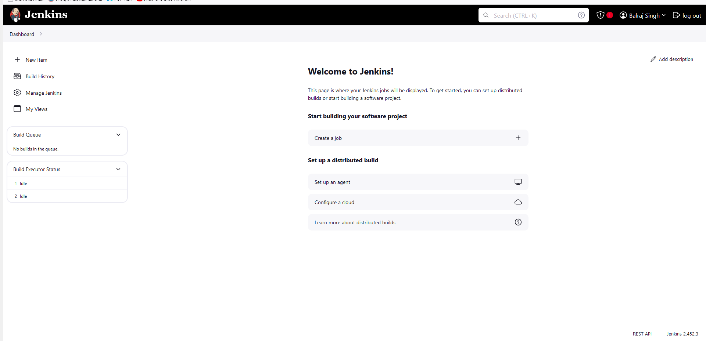

Now, we will try to access the SonarQube as it is accessible via 9000, Make sure add 9000 ports in the security group.

```bash
<ec2-public-ip:9000>
```


Dashboard of SonarQube


### Verify the Trivy version on Jenkins machine
```bash
$ trivy --version
Version: 0.53.0
```
### Configure Splunk
Verify the Public IP address of Splunk and open it in browser.
```basg
<splunk-public-ip:8000>
```


Log in using the username and password you set up when you created Splunk.

Dashboard for Splunk


+ Install the Splunk app for Jenkins <br> 
*You should have splunk webportal login credentails, if not then create your login credentails first*

In Splunk Dashboard > Click on Apps > Find more apps


Search for Jenkins in the search bar. When you see the Splunk app for Jenkins, click on install.
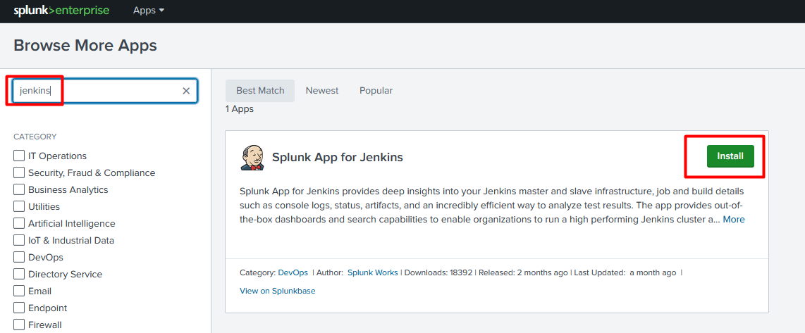


Click on ```go home```

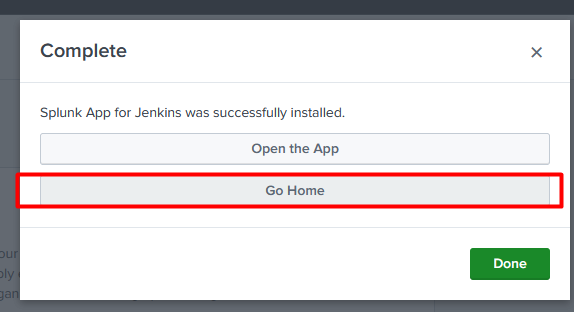

- On the Splunk homepage, you will see that Jenkins has been added.

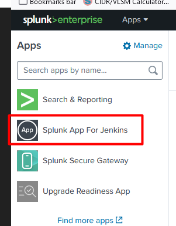

In the Splunk web interface, go to Settings > Data Inputs.


Click on HTTP Event Collector and Click on Global Settings

Set All tokens to enabled > Uncheck SSL enable > Use 8088 port and click on save


Now click on New token


Provide a Name and click on the next > Review > Click Submit


Click Start searching> Now let’s copy our token again> In the Splunk web interface, go to Settings > Data Inputs> Click on the HTTP event collector >Now copy your token and keep it safe.


* Add Splunk Plugin in Jenkins <br>
Go to Jenkins dashboard > Click on Manage Jenkins > Plugins > Available plugins > Search for Splunk and install it.


Now, Click on Manage Jenkins <br>
> System > Go to Splunk > Check to enable >  HTTP input host as SPLUNK PUBLIC IP > HTTP token that you generated in Splunk> Jenkins IP and apply.
 Don't forget to tick on Enable checkbox. 

if connect is failed then following the below steps on Splunk EC2 Machine.
```bash
ubuntu@ip-172-31-23-110:~$ sudo ufw allow 8088
Rules updated
Rules updated (v6)

ubuntu@ip-172-31-23-110:~$ sudo ufw status
Status: inactive

ubuntu@ip-172-31-23-110:~$ sudo ufw allow openSSH
Rules updated
Rules updated (v6)

ubuntu@ip-172-31-23-110:~$ sudo ufw allow 8000
Rules updated
Rules updated (v6)

ubuntu@ip-172-31-23-110:~$ sudo ufw status
Status: inactive

ubuntu@ip-172-31-23-110:~$ sudo ufw enable
Command may disrupt existing ssh connections. Proceed with operation (y|n)? y
Firewall is active and enabled on system startup
ubuntu@ip-172-31-23-110:~$
```
- Check Network Connectivity from Jenkins to Splunk
```sh
ping 52.204.146.179
telnet 52.204.146.179 8088
```
+ Restart Splunk and Jenkins services to make it effective.

Procedure to restart *Jenkins* <br>
> Jenkins Public IP Address:8080/restart
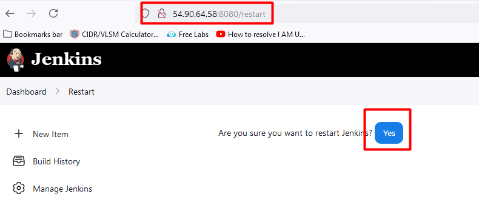

Procedure to restart *Splunk* <br>
Click on Settings > Server controls > Restart splunk.


### On Jenkins Server, we will create a simple hello pipeline and will see if logs are visible in Splunk or not.

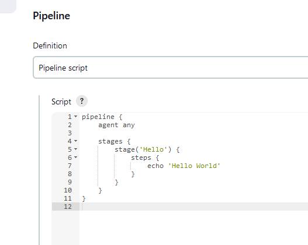


Now go to Splunk, click on the Jenkins app, and you will see some data from Jenkins.

> we can see the logs in splunk. :-)

If you want to see the more details logs then switch it to ```admin``` and you will see below <br>


## Integrate Slack for Notifications
If you don't have a Slack account, create one first. If you already have an account, log in. [Slack login](https://slack.com/signin#/signin)
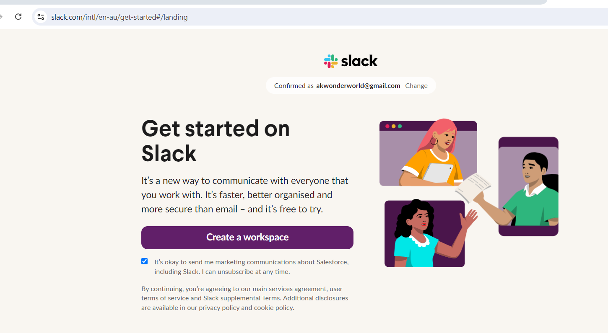 <br>
Create a Slack account and create a channel Named "Jenkins_Notification"
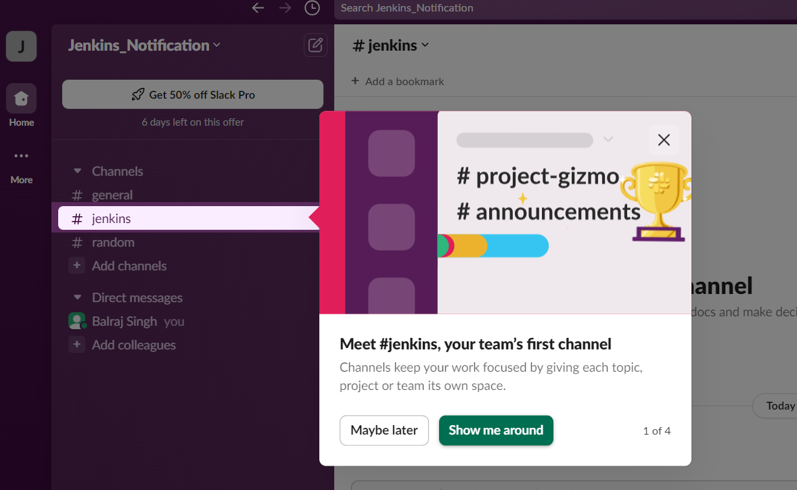

+ Install the Jenkins CI app on Slack <br>
> Go to Slack and click on your name > Select Settings and Administration > Click on Manage apps
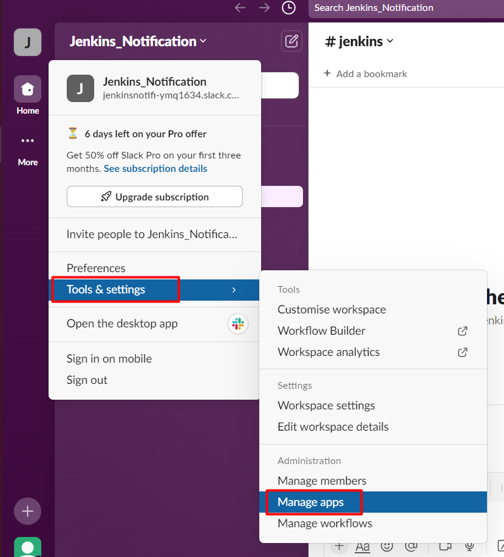

search here "```Jenkins CI```" > Click on ```Add to Slack``` <Br>
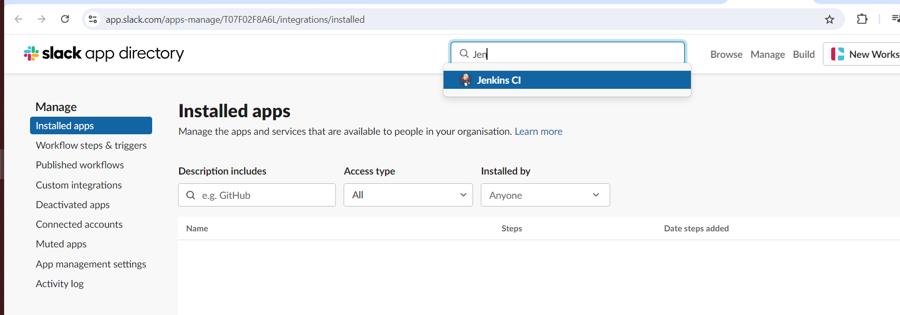

Select the change name "Jenkins" and click on ```add Jenkins CI integration```


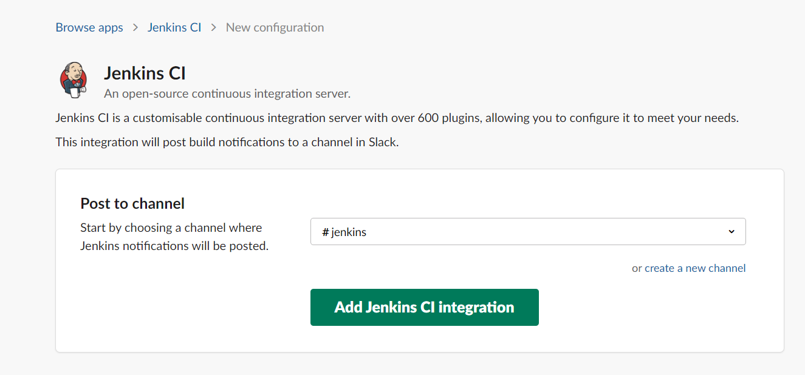

You will be sent to this page


### Install Slack Notification Plugin in Jenkins
 > Go to Jenkins Dashboard > Click on manage Jenkins > Plugins > Available plugins "Search for Slack Notification and install"


Now, we will be configure the credential <br>
> Click on Manage Jenkins –> Credentials > Global > Select kind as Secret Text > At Secret Section Provide Your Slack integration token credential ID> Id and description are optional and create


in Slack Step 3 it is mention the token.


> Click on Manage Jenkins > System > Go to the end of the page > Workspace > team subdomain > Credential –> Select your Credential for Slack > Default channel –> Provide your Channel name > Test connection > Click on Apply and save


You will get a notification as below on Slack app.


Add this to the pipeline
```bash
def COLOR_MAP = [
    'FAILURE' : 'danger',
    'SUCCESS' : 'good'
]
post {
    always {
        echo 'Slack Notifications'
        slackSend (
            channel: '#jenkins',   #change your channel name
            color: COLOR_MAP[currentBuild.currentResult],
            message: "*${currentBuild.currentResult}:* Job ${env.JOB_NAME} \n build ${env.BUILD_NUMBER} \n More info at: ${env.BUILD_URL}"
        )
    }
}
```
If you don't know how to do [Integrating Slack with Jenkins](https://www.youtube.com/watch?v=9ZUy3oHNgh8&t=0s)

- Sample pipeline with post action.
```bash
def COLOR_MAP = [
    'FAILURE' : 'danger',
    'SUCCESS' : 'good'
]


pipeline {
    agent any

    stages {
        stage('Hello') {
            steps {
                echo 'Hello World'
            }
        }
    }


post {
always {
    echo 'Slack Notifications'
    slackSend (
        channel: '#jenkins',
        color: COLOR_MAP[currentBuild.currentResult],
        message: "*${currentBuild.currentResult}:* Job ${env.JOB_NAME} \n build ${env.BUILD_NUMBER} \n More info at: ${env.BUILD_URL}"
    )
}
}
}
```

- Slack Notification


- Splunk Notification


Should have an __[rapidapi](https://rapidapi.com/)__ account.

"Once you have an account, your name will automatically appear in Rapid API."


In the search bar, type "YouTube" and choose "YouTube v3."

