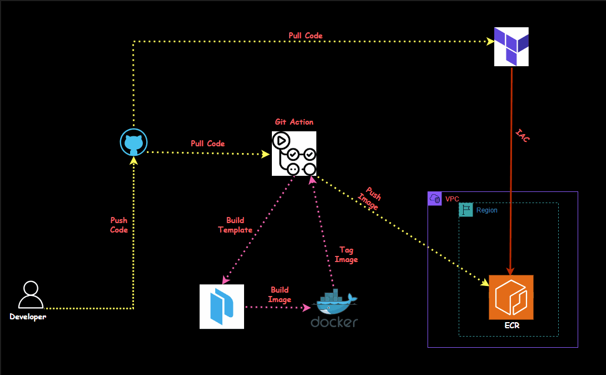
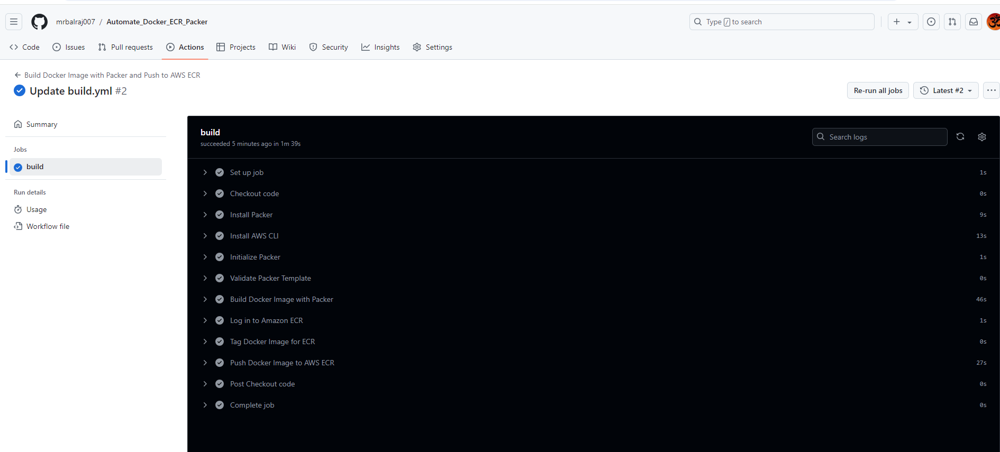

# <span style="color: Yellow;"> Automate Docker Image Deployment to AWS ECR Using GitHub Actions</span>

In this session, we'll dive into automating the process of building Docker images using Packer and deploying them to Amazon ECR (Elastic Container Registry) with GitHub Actions. By the end of this, you'll understand how to create an ECR repository, set up credentials, build and tag a Docker image using Packer, and automate the entire workflow using GitHub Actions.



## <span style="color: Yellow;"> Prerequisites </span>
 
Before you start, ensure you have the following:
- [x] [Clone repository for terraform code](https://github.com/mrbalraj007/DevOps_free_Bootcamp/tree/main/10.Real-Time-DevOps-Project/Terraform_Code) 
- [x] [Code Repo](https://github.com/mrbalraj007/Automate_Docker_ECR_Packer.git)
- [x] AWS Account: Set up with IAM access (access key & secret key) for ECR.
- [x] GitHub Repository: A repository to hold your Packer configuration and GitHub Actions workflow.
- [x] Basic Knowledge of Docker: Familiarity with Docker images and containers.
- [x] Installed Tools: AWS CLI, GitHub Actions, and Packer installed on your local machine.

## <span style="color: Yellow;">Setting Up the Environment </span>
I have created a Terraform file to set up the entire environment, including the installation of required applications, tools, and the ECR automatically created.

#### <span style="color: Yellow;">Setting Up the ECR

First, we'll create the necessary virtual machines using ```terraform```. 

Below is a terraform configuration:

Once you [clone repo](https://github.com/mrbalraj007/DevOps_free_Bootcamp.git) then go to folder *<span style="color: cyan;">"10.Real-Time-DevOps-Project/Terraform_Code"</span>* and run the terraform command.
```bash
cd Terraform_Code/

$ ls -l
Mode                 LastWriteTime         Length Name
----                 -------------         ------ ----
da---l          10/09/24   7:32 PM                Terraform_Code
```

__<span style="color: Red;">Note__</span> &rArr; Make sure to run ```main.tf``` from inside the folders.

```bash
cd 11.Real-Time-DevOps-Project/Terraform_Code"

Mode                 LastWriteTime         Length Name
----                 -------------         ------ ----
-a---l          21/08/24   2:56 PM            500 .gitignore
-a---l          10/09/24   7:29 PM           4287 main.tf
```
You need to run ```main.tf``` file using following terraform command.

#### Now, run the following command.
```bash
terraform init
terraform fmt
terraform validate
terraform plan
terraform apply --auto-approve
```


It will create an ECR and give you an ECR name and ID; that ID and name need to be updated in the git action code.

On git repo, select the repo "Automate_Docker_ECR_Packer" and go to setting> ```Secrets and variables```, click on ```action``` and create the following environment variable which will be used in pipeline.


will go to ```.github/workflows/build.yml``` and will update the ECR ID and name in pipeline and run it.

__<span style="color: Red;">*Note__-* ```373160674113```, update it in below pipeline as per your ECR ID. 

```bash
name: Build Docker Image with Packer and Push to AWS ECR

on:
  push:
    branches:
      - main

jobs:
  build:
    runs-on: ubuntu-latest

    steps:
    - name: Checkout code
      uses: actions/checkout@v3

    - name: Install Packer
      run: |
        sudo apt-get update -y
        sudo apt-get install -y wget unzip
        wget https://releases.hashicorp.com/packer/1.9.0/packer_1.9.0_linux_amd64.zip
        unzip packer_1.9.0_linux_amd64.zip
        sudo mv packer /usr/local/bin/

    - name: Install AWS CLI
      run: |
        sudo apt-get update -y
        sudo apt-get install -y awscli

    - name: Initialize Packer
      run: packer init .

    - name: Validate Packer Template
      run: |
        packer validate packer.pkr.hcl

    - name: Build Docker Image with Packer
      run: |
        packer build packer.pkr.hcl

    - name: Log in to Amazon ECR
      env:
        AWS_REGION: ${{ secrets.AWS_REGION }}
        AWS_ACCESS_KEY_ID: ${{ secrets.AWS_ACCESS_KEY_ID }}
        AWS_SECRET_ACCESS_KEY: ${{ secrets.AWS_SECRET_ACCESS_KEY }}
      run: |
        aws ecr get-login-password --region $AWS_REGION | docker login --username AWS --password-stdin 373160674113.dkr.ecr.$AWS_REGION.amazonaws.com

    - name: Tag Docker Image for ECR
      run: |
        docker tag docker-image:latest ${{ secrets.AWS_ACCOUNT_ID }}.dkr.ecr.${{ secrets.AWS_REGION }}.amazonaws.com/docker-image:latest
        docker tag docker-image:v1.0.0 ${{ secrets.AWS_ACCOUNT_ID }}.dkr.ecr.${{ secrets.AWS_REGION }}.amazonaws.com/docker-image:v1.0.0


    - name: Push Docker Image to AWS ECR
      run: |
        docker push 373160674113.dkr.ecr.${{ secrets.AWS_REGION }}.amazonaws.com/docker-image:latest
        docker push 373160674113.dkr.ecr.${{ secrets.AWS_REGION }}.amazonaws.com/docker-image:v1.0.0
```



Outcomes in ECR:


## <span style="color: Yellow;"> Key Steps Covered </span>

#### <span style="color: cyan;"> __01__. Create AWS ECR Repository:

- Set up a new ECR repository on AWS to store your Docker images.
- Generate an IAM user with appropriate permissions for pushing images to ECR.
- Store the IAM credentials securely for later use.

#### <span style="color: cyan;"> __02__. Set Up Packer Configuration:

- Write a Packer configuration file to build a Docker image.
- Use the base Ubuntu 20.04 image and install necessary packages.
- Tag the Docker image (e.g., latest, v1.0.0).
- Configure GitHub Actions Workflow:

#### <span style="color: cyan;"> __03__. Set up a GitHub Actions workflow that triggers on every commit.
- Install Packer and AWS CLI in the GitHub runner.
- Log in to AWS ECR using stored credentials and push the Docker image.

#### <span style="color: cyan;"> __04__. Store Secrets in GitHub:

- Store sensitive AWS credentials in GitHub Secrets (Access Key, Secret Key, Region, and Account ID).
  
#### <span style="color: cyan;"> __05__. Trigger Workflow and Validate:

- After committing code, GitHub Actions will automatically trigger the build, push the image, and update the ECR repository.
- Verify the Docker image in the ECR console.

## <span style="color: Yellow;"> Key Benefits of Using GitHub Actions for Docker Image Deployment </span>
- Automation: Every time you push changes to your repository, the GitHub Actions workflow will automatically build and deploy the Docker image to AWS ECR.
- Consistency: Using Packer ensures that the image-building process is consistent and reproducible.
- Integration: Direct integration between GitHub Actions and AWS services (ECR in this case) simplifies the CI/CD process.

## <span style="color: Yellow;"> What to Avoid </span>
- Exposing Credentials: Always store your credentials in secure locations like GitHub Secrets. Never hardcode sensitive information in your configuration files.
- Skipping Validation: Before pushing images, validate your Packer configuration to avoid issues during deployment.

## <span style="color: Yellow;"> Use Case: </span>
This approach is ideal for teams using Docker in production environments who want to automate the process of building, tagging, and pushing Docker images to AWS ECR. It’s particularly useful for DevOps teams practicing continuous integration and deployment (CI/CD) in cloud-native environments.

## <span style="color: Yellow;"> Conclusion </span>
By leveraging GitHub Actions, you can automate the Docker image build and deployment process to AWS ECR, ensuring a seamless CI/CD pipeline. Packer helps ensure your Docker images are built consistently, and GitHub Actions takes care of automating the entire process.

__Ref Link__

- [YouTube Link](https://www.youtube.com/watch?v=5HgGRqJ8Jlw&list=PLJcpyd04zn7rZtWrpoLrnzuDZ2zjmsMjz&index=88 "Automate Docker Image Deployment to AWS ECR Using GitHub Actions")


