# <span style="color: Yellow;"> Creating a Starbucks Clone on AWS: A Comprehensive DevSecOps Guide</span>

In this blog, we’ll walk you through deploying a Starbucks clone on AWS using a DevSecOps approach. This process integrates development, security, and operations practices to ensure a smooth and secure deployment. We’ll cover the key steps, technologies used, and how to troubleshoot common issues.

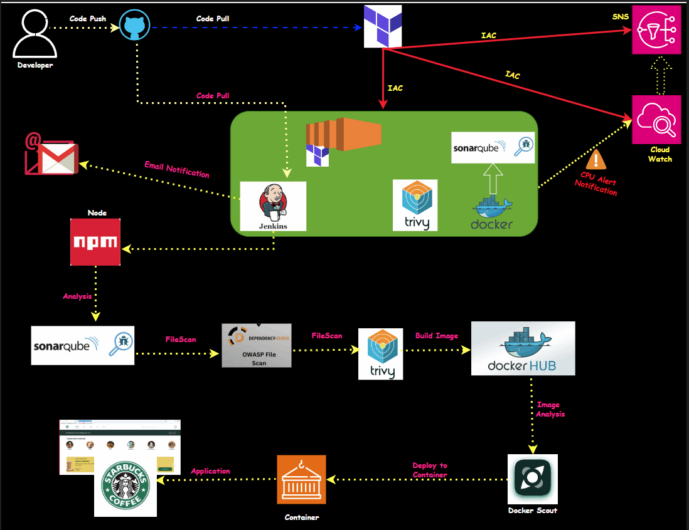

## <span style="color: Yellow;"> Prerequisites for This Project </span>
 
Before you start, ensure you have the following:
- [x] [Terraform Code](https://github.com/mrbalraj007/DevOps_free_Bootcamp/tree/main/11.Real-Time-DevOps-Project/Terraform_Code) 
- [x] [App Code Repo](https://github.com/mrbalraj007/starbucks.git)
- [x] AWS Account: Set up an account to manage resources and services.
- [x] Jenkins Installed: Ensure Jenkins is configured and running for CI/CD processes.
- [x] Docker: Install Docker and Docker Scout for building and scanning Docker images.
- [x] AWS Services: Configure AWS CloudWatch for monitoring and SNS for notifications.
- [x] SonarQube: Install and configure SonarQube for code quality analysis.
- [x] OWASP Dependency-Check: Install for vulnerability scanning of project dependencies.

## <span style="color: Yellow;"> Technologies Used:</span>
- __Jenkins__: Automation server for building, testing, and deploying code.
- __Docker__: Container platform for building and running applications.
- __Docker Hub__: Repository for storing and sharing Docker images.
- __CloudWatch__: AWS service for monitoring and managing cloud resources.
- __SNS (Simple Notification Service)__: AWS service for sending notifications.
- __SonarQube__: Code quality and security analysis tool.
- __OWASP Dependency-Check__: Tool for identifying vulnerabilities in project dependencies.
- __[Docker Scout](https://earthly.dev/blog/docker-scout/, 'What Is Docker Scout and How to Use It')__: Tool for scanning Docker images for security vulnerabilities.


## <span style="color: Yellow;">Setting Up the Environment </span>
I have created a Terraform file to set up the entire environment, including the installation of required applications, tools, and the EKS cluster automatically created.

<span style="color: cyan;"> __Note__&rArr;</span> I was using <span style="color: red;">```t3.medium```</span> and having performance issues; I was unable to run the pipeline, and it got stuck in between. So, I am now using ```t2.xlarge``` now. Also, you have to update ```your email address``` in the ```main.tf``` file so that topic for alerting can be created while creation the VM.

#### <span style="color: Yellow;">Setting Up the Virtual Machines (EC2)

First, we'll create the necessary virtual machines using ```terraform```. 

Below is a terraform configuration:

Once you [clone repo](https://github.com/mrbalraj007/DevOps_free_Bootcamp.git) then go to folder *<span style="color: cyan;">"11.Real-Time-DevOps-Project/Terraform_Code"</span>* and run the terraform command.
```bash
cd Terraform_Code/

$ ls -l
Mode                 LastWriteTime         Length Name
----                 -------------         ------ ----
da---l          10/09/24   7:32 PM                Terraform_Code
```

__<span style="color: Red;">Note__</span> &rArr; Make sure to run ```main.tf``` from inside the folders.

```bash
cd 11.Real-Time-DevOps-Project/Terraform_Code"

Mode                 LastWriteTime         Length Name
----                 -------------         ------ ----
-a---l          21/08/24   2:56 PM            500 .gitignore
-a---l          10/09/24   7:29 PM           4287 main.tf
-a---l          10/09/24   1:17 PM           3379 terrabox_install.sh
```
You need to run ```main.tf``` file using following terraform command.

#### Now, run the following command.
```bash
terraform init
terraform fmt
terraform validate
terraform plan
terraform apply --auto-approve
```
-------
### __Environment Setup__
|HostName|OS|
|:----:|:----:|
|Jenkins| Ubuntu 24 LTS|

> * Password for the **root** account on all these virtual machines is **xxxxxxx**
> * Perform all the commands as root user unless otherwise specified

Once you run the terraform command, then we will verify the following things to make sure everything is setup via a terraform.

#### <span style="color: cyan;">Verify the Jenkins version </span>
```bash
# jenkins --version
ubuntu@ip-172-31-95-197:~$ jenkins --version
2.462.2
```
#### <span style="color: cyan;"> Verify the Trivy version
```bash
# trivy --version
ubuntu@ip-172-31-95-197:~$ trivy --version
Version: 0.55.0
```
#### <span style="color: cyan;"> Verify the Docker & Docker Scout version
```bash
# docker --version
# docker-scout version

ubuntu@ip-172-31-95-197:~$ docker --version
Docker version 24.0.7, build 24.0.7-0ubuntu4.1


docker ps -a
CONTAINER ID   IMAGE                     COMMAND                  CREATED          STATUS          PORTS                                       NAMES
0b976c169a37   sonarqube:lts-community   "/opt/sonarqube/dock…"   12 minutes ago   Up 12 minutes   0.0.0.0:9000->9000/tcp, :::9000->9000/tcp   sonar


ubuntu@ip-172-31-95-197:~$ docker-scout version

      ⢀⢀⢀             ⣀⣀⡤⣔⢖⣖⢽⢝
   ⡠⡢⡣⡣⡣⡣⡣⡣⡢⡀    ⢀⣠⢴⡲⣫⡺⣜⢞⢮⡳⡵⡹⡅
  ⡜⡜⡜⡜⡜⡜⠜⠈⠈        ⠁⠙⠮⣺⡪⡯⣺⡪⡯⣺
 ⢘⢜⢜⢜⢜⠜               ⠈⠪⡳⡵⣹⡪⠇
 ⠨⡪⡪⡪⠂    ⢀⡤⣖⢽⡹⣝⡝⣖⢤⡀    ⠘⢝⢮⡚       _____                 _
  ⠱⡱⠁    ⡴⡫⣞⢮⡳⣝⢮⡺⣪⡳⣝⢦    ⠘⡵⠁      / ____| Docker        | |
   ⠁    ⣸⢝⣕⢗⡵⣝⢮⡳⣝⢮⡺⣪⡳⣣    ⠁      | (___   ___ ___  _   _| |_
        ⣗⣝⢮⡳⣝⢮⡳⣝⢮⡳⣝⢮⢮⡳            \___ \ / __/ _ \| | | | __|
   ⢀    ⢱⡳⡵⣹⡪⡳⣝⢮⡳⣝⢮⡳⡣⡏    ⡀       ____) | (_| (_) | |_| | |_
  ⢀⢾⠄    ⠫⣞⢮⡺⣝⢮⡳⣝⢮⡳⣝⠝    ⢠⢣⢂     |_____/ \___\___/ \__,_|\__|
  ⡼⣕⢗⡄    ⠈⠓⠝⢮⡳⣝⠮⠳⠙     ⢠⢢⢣⢣
 ⢰⡫⡮⡳⣝⢦⡀              ⢀⢔⢕⢕⢕⢕⠅
 ⡯⣎⢯⡺⣪⡳⣝⢖⣄⣀        ⡀⡠⡢⡣⡣⡣⡣⡣⡃
⢸⢝⢮⡳⣝⢮⡺⣪⡳⠕⠗⠉⠁    ⠘⠜⡜⡜⡜⡜⡜⡜⠜⠈
⡯⡳⠳⠝⠊⠓⠉             ⠈⠈⠈⠈

version: v1.13.0 (go1.22.5 - linux/amd64)
git commit: 7a85bab58d5c36a7ab08cd11ff574717f5de3ec2
ubuntu@ip-172-31-95-197:~$
```
#### <span style="color: cyan;"> Verify the cloud watch alert</span>

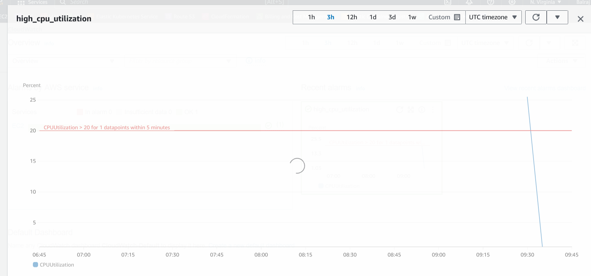


#### <span style="color: cyan;"> Verify the SNS & Topics</span>
Once you open your gmail account and click on AWS notification Subscription confirmation email and click ```confirm subscript``` for topic subsription.


## <span style="color: yellow;"> Setup the Jenkins </span>
Notedown the public address of the VM and access it in browser
```bash
<publicIP of VM :8080>
```
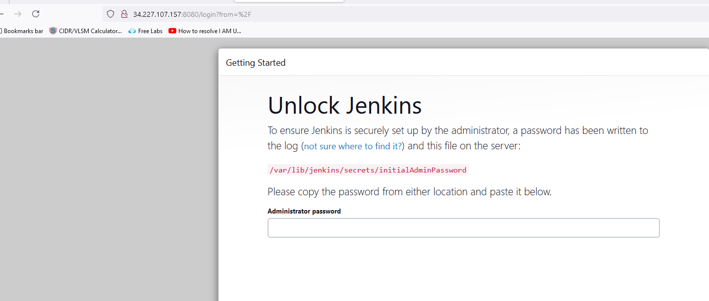

will run this command on VM ```sudo cat /var/lib/jenkins/secrets/initialAdminPassword``` to get the first time login password.


#### <span style="color: cyan;">  Install ```Plug-in ```in Jenkins.

We will install the following ```plug-in``` in jenkins.<br>

Dashboard&rArr; Manage Jenkins&rArr; plug-in

```bash
Eclipse Temurin installer
NodeJS
SonarQube Scanner
Docker
Docker Common
Docker Pipeline
Docker API
OWASP Dependency-Check
Email Extension Template
Pipeline: Stage View
Blue Ocean (Optional)
```

#### <span style="color: cyan;">  Configure the tools in Jenkins.

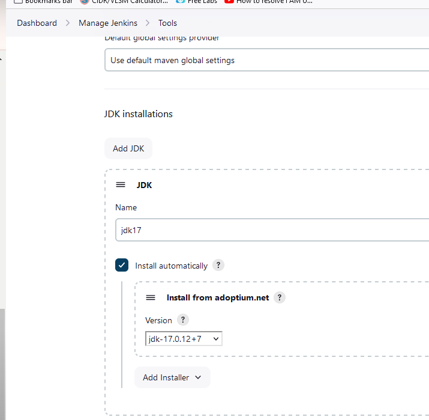


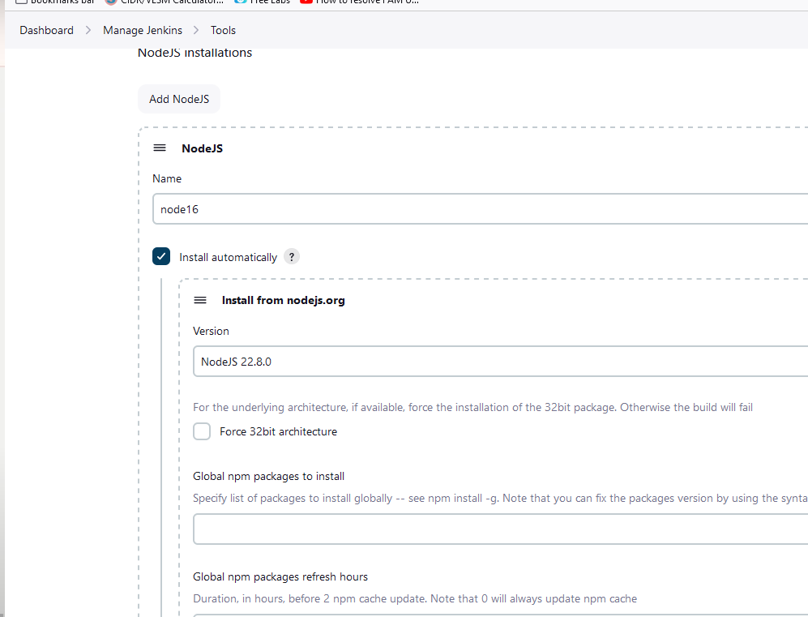

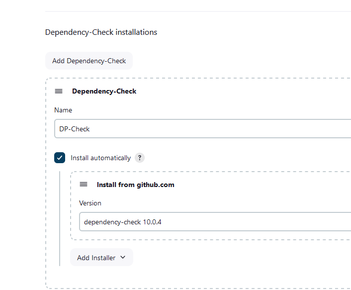

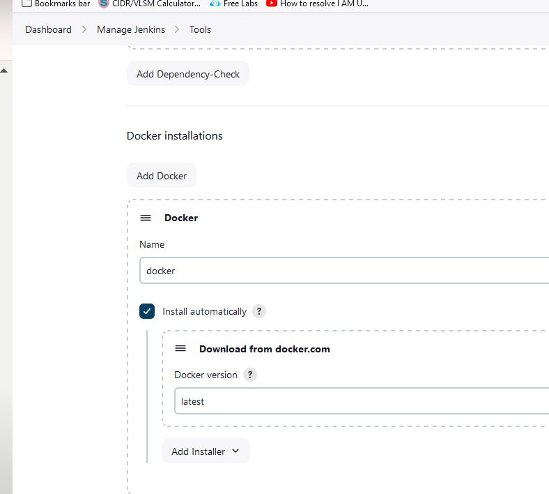


## <span style="color: yellow;"> Setup the SonarQube </span>
As we installed SonarQube as a container on the same Jenkins VM. So, we will select the public IP address of Jenkins.

```bash
<publicIP of VM :9000>
```


- Default user name & password is ```admin/admin``` and you need to change it.

#### <span style="color: cyan;"> Intigrate SonarQube to Jenkins and vise-versa


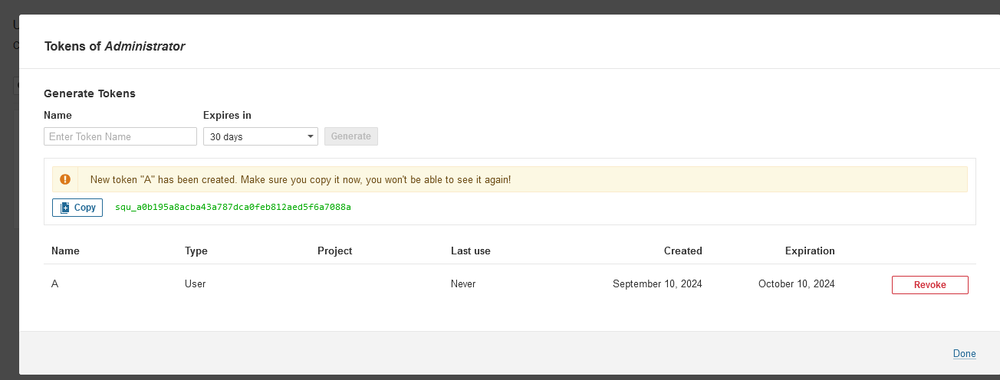

#### <span style="color: cyan;"> On Jenkins UI Console- 

    Dashboard
    Manage Jenkins
    Credentials
    System
    Global credentials (unrestricted)

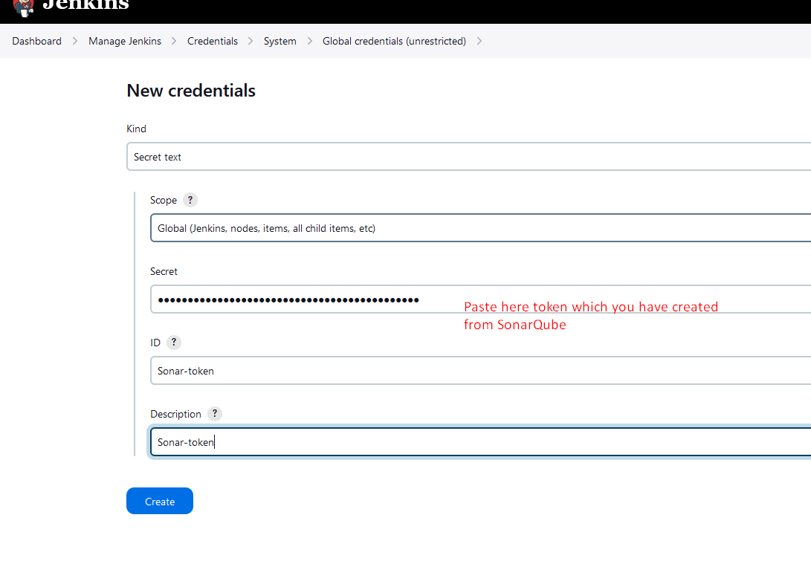


#### <span style="color: cyan;"> Configure QualityGateway: (SonarQube)


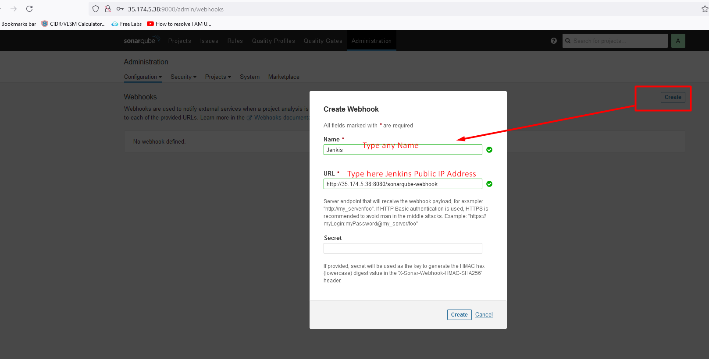


on Jenkins UI- 

    Dashboard
    Manage Jenkins
    System


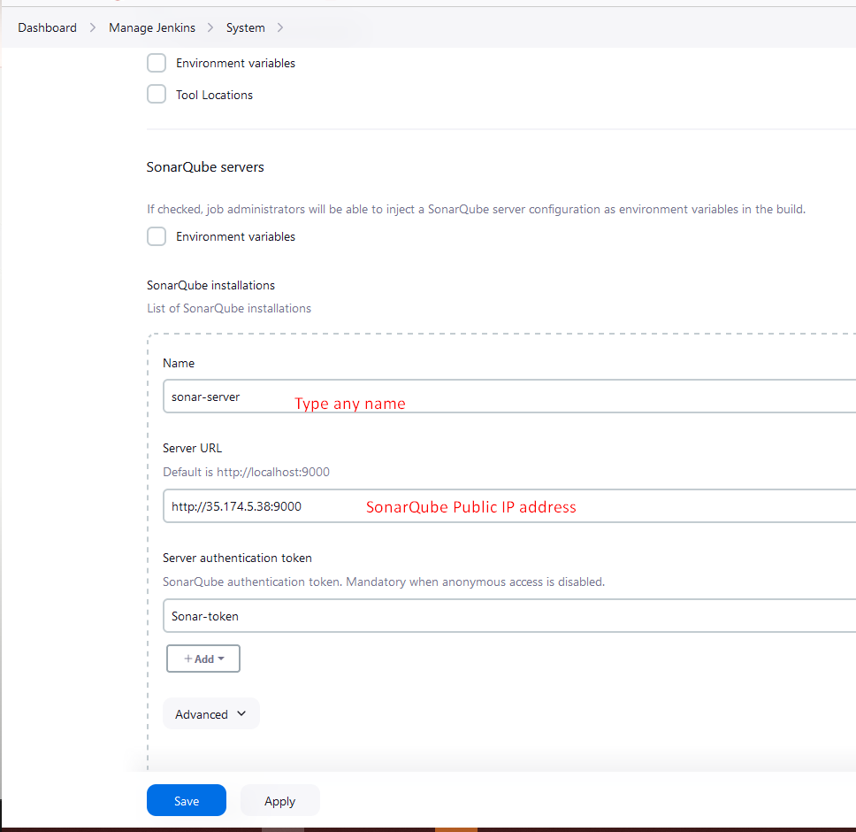

#### <span style="color: cyan;">Configure the Docker credential 


#### <span style="color: cyan;">Extended E-mail Notification 
  
- configure the password for email notification apps


#### <span style="color: cyan;">e-mail notification setup 


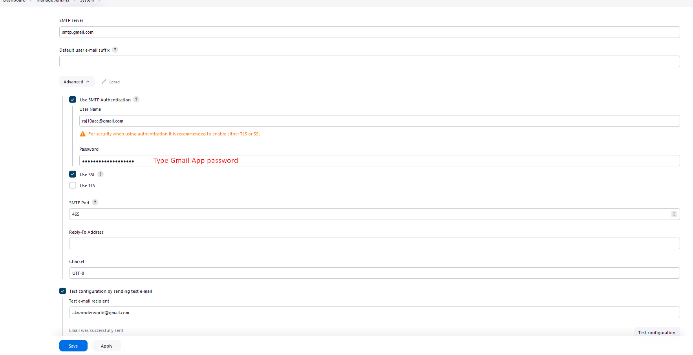

got email in gmail inbox-


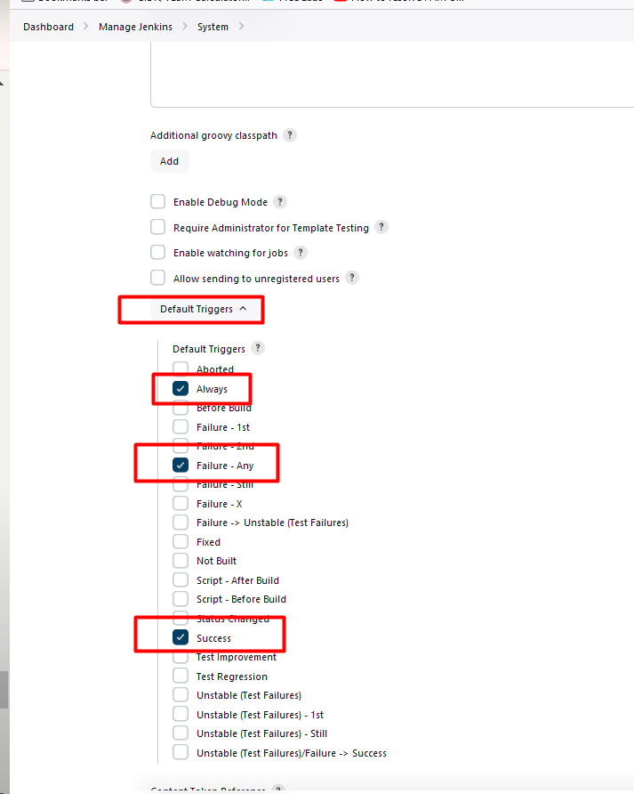


## <span style="color: yellow;"> Create Pipeline


```sh
pipeline {
    agent any
    tools {
        jdk 'jdk17'
        nodejs 'node16'
    }
    environment {
        SCANNER_HOME=tool 'sonar-scanner'
    }
    stages {
        stage ("clean workspace") {
            steps {
                cleanWs()
            }
        }
        stage ("Git checkout") {
            steps {
                git branch: 'main', url: 'https://github.com/mrbalraj007/starbucks.git'
            }
        }
        stage("Sonarqube Analysis "){
            steps{
                withSonarQubeEnv('sonar-server') {
                    sh ''' $SCANNER_HOME/bin/sonar-scanner -Dsonar.projectName=starbucks \
                    -Dsonar.projectKey=starbucks '''
                }
            }
        }
        stage("quality gate"){
           steps {
                script {
                    waitForQualityGate abortPipeline: false, credentialsId: 'Sonar-token' 
                }
            } 
        }
        stage("Install NPM Dependencies") {
            steps {
                sh "npm install"
            }
        }
        stage('OWASP FS SCAN') {
            steps {
                dependencyCheck additionalArguments: '--scan ./ --disableYarnAudit --disableNodeAudit', odcInstallation: 'DP-Check'
                dependencyCheckPublisher pattern: '**/dependency-check-report.xml'
            }
        }
        stage ("Trivy File Scan") {
            steps {
                sh "trivy fs . > trivy.txt"
            }
        }
        stage ("Build Docker Image") {
            steps {
                sh "docker build -t starbucks ."
            }
        }
        stage ("Tag & Push to DockerHub") {
            steps {
                script {
                    withDockerRegistry(credentialsId: 'docker') {
                        sh "docker tag starbucks balrajsi/starbucks:latest "
                        sh "docker push balrajsi/starbucks:latest "
                    }
                }
            }
        }
        stage('Docker Scout Image') {
            steps {
                script{
                   withDockerRegistry(credentialsId: 'docker', toolName: 'docker'){
                       sh 'docker-scout quickview balrajsi/starbucks:latest'
                       sh 'docker-scout cves balrajsi/starbucks:latest'
                       sh 'docker-scout recommendations balrajsi/starbucks:latest'
                   }
                }
            }
        }
        stage ("Deploy to Conatiner") {
            steps {
                sh 'docker run -d --name starbucks -p 3000:3000 balrajsi/starbucks:latest'
            }
        }
    }
    post {
    always {
        emailext attachLog: true,
            subject: "'${currentBuild.result}'",
            body: """
                <html>
                <body>
                    <div style="background-color: #FFA07A; padding: 10px; margin-bottom: 10px;">
                        <p style="color: white; font-weight: bold;">Project: ${env.JOB_NAME}</p>
                    </div>
                    <div style="background-color: #90EE90; padding: 10px; margin-bottom: 10px;">
                        <p style="color: white; font-weight: bold;">Build Number: ${env.BUILD_NUMBER}</p>
                    </div>
                    <div style="background-color: #87CEEB; padding: 10px; margin-bottom: 10px;">
                        <p style="color: white; font-weight: bold;">URL: ${env.BUILD_URL}</p>
                    </div>
                </body>
                </html>
            """,
            to: 'provide_your_Email_id_here',
            mimeType: 'text/html',
            attachmentsPattern: 'trivy.txt'
        }
    }
}
```
#### <span style="color: cyan;">Pipeline Status
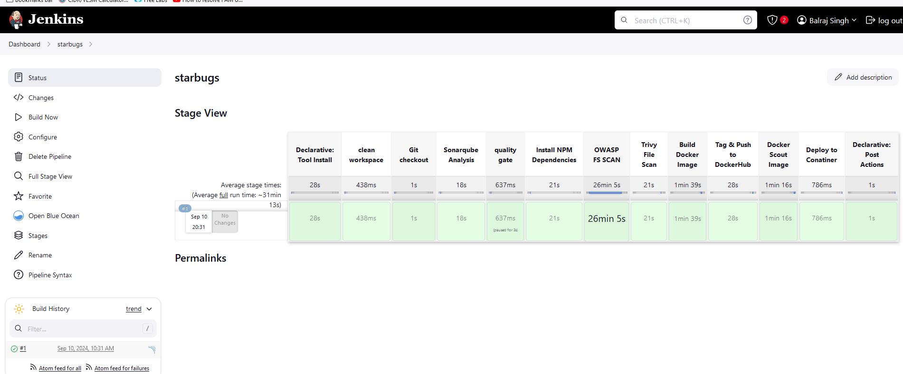

#### <span style="color: cyan;">Email Notification for a successful build.
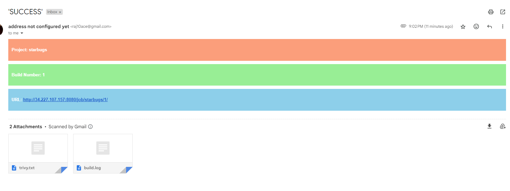

#### <span style="color: cyan;">To verify the container image in ```Docker hub```


#### <span style="color: cyan;">To verify the container image in ```Jinkins Server```


#### <span style="color: cyan;">To verify the application
As we build the container on the same Jenkins VM. So, we will select the public IP address of Jenkins.

```bash
<publicIP of VM :3000>
```
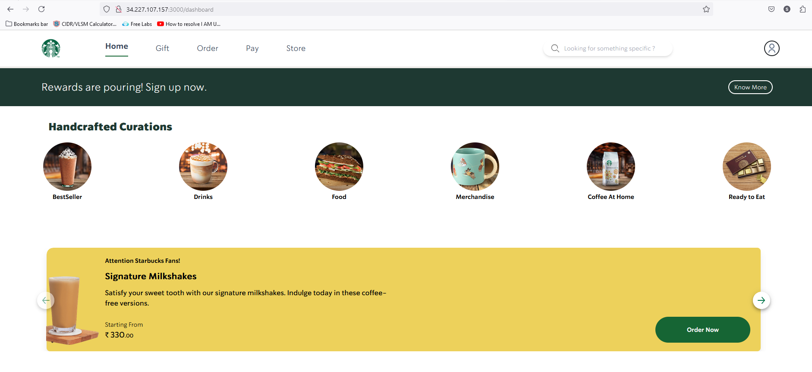

#### <span style="color: cyan;">EC2 resource details
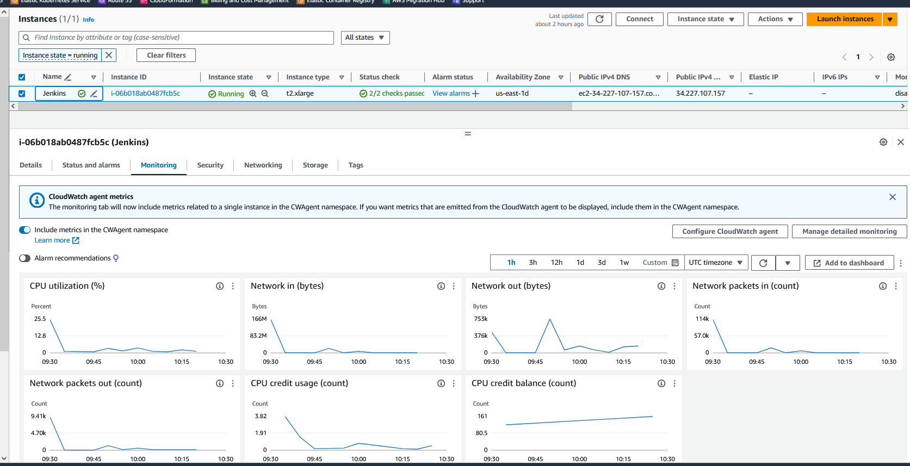

#### <span style="color: cyan;">CloudWatch Status.
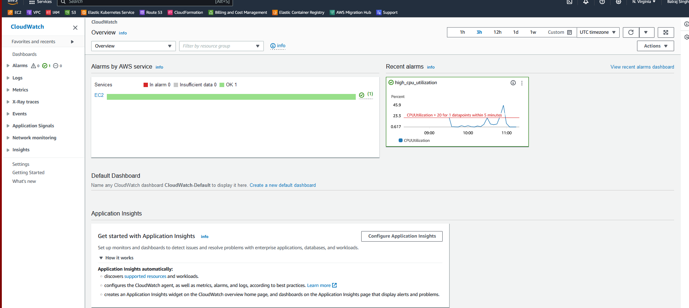

## <span style="color: Yellow;"> Environment Cleanup:
- As we are using Terraform, we will use the following command to delete the environment
```bash
terraform destroy --auto-approve
```
#### <span style="color: cyan;">Time to delete the Virtual machine.

Go to folder *<span style="color: cyan;">"11.Real-Time-DevOps-Project/Terraform_Code"</span>* and run the terraform command.
```bash
cd Terraform_Code/

$ ls -l
Mode                 LastWriteTime         Length Name
----                 -------------         ------ ----
da---l          10/09/24   9:48 PM                Terraform_Code

Terraform destroy --auto-approve
```


## <span style="color: Yellow;"> Key Takeaways:
- Automated CI/CD Pipeline: Automating the build, test, and deployment process improves efficiency and reduces manual intervention.
- Error Handling: Ensure all required tools and configurations are in place to avoid build failures.
- Monitoring and Alerts: Utilize CloudWatch and SNS to monitor system performance and receive timely notifications.
- Enhanced Security: Integration of OWASP, Docker Scout, and Dependency-Check ensures a secure deployment pipeline.
- Code Quality: SonarQube helps maintain high code quality standards.


## <span style="color: Yellow;"> What to Avoid:
- Skipping Security Scans: Always include security scans to identify and mitigate vulnerabilities.
- Ignoring Resource Monitoring: Regularly check resource utilization to prevent potential issues.
Overlooking Dependency Management: Regularly update and check dependencies for vulnerabilities.


## <span style="color: Yellow;"> Key Benefits:
- *Efficiency: Automating pipeline stages saves time and reduces manual errors*.
- *Security: Regular scans with Docker Scout and OWASP Dependency-Check help identify and fix vulnerabilities*.
- *Reliability: Continuous integration and deployment ensure consistent and reliable application updates.*


## <span style="color: Yellow;"> Why Use This Project:
- *Deploying a Starbucks clone using this approach not only demonstrates practical skills in integrating various DevSecOps tools but also highlights the importance of security and efficiency in modern software deployment. It showcases how to build, test, and deploy applications securely and efficiently, leveraging cloud services and CI/CD practices.*

## <span style="color: Yellow;"> Use Case:
- *This setup is ideal for development teams looking to implement a robust CI/CD pipeline to automate their build, test, and deployment processes. It ensures high-quality code delivery with continuous monitoring and security checks.*


__Ref Link__

- [YouTube Link](https://www.youtube.com/watch?v=N_AEbtTLcgY&list=PLJcpyd04zn7rZtWrpoLrnzuDZ2zjmsMjz&index=77 "Deploy Starbucks Clone on AWS Using a DevSecOps Approach | Complete Guide")
- [Docker Scout](https://docs.docker.com/scout/)
- [What Is Docker Scout and How to Use It](https://earthly.dev/blog/docker-scout/)
